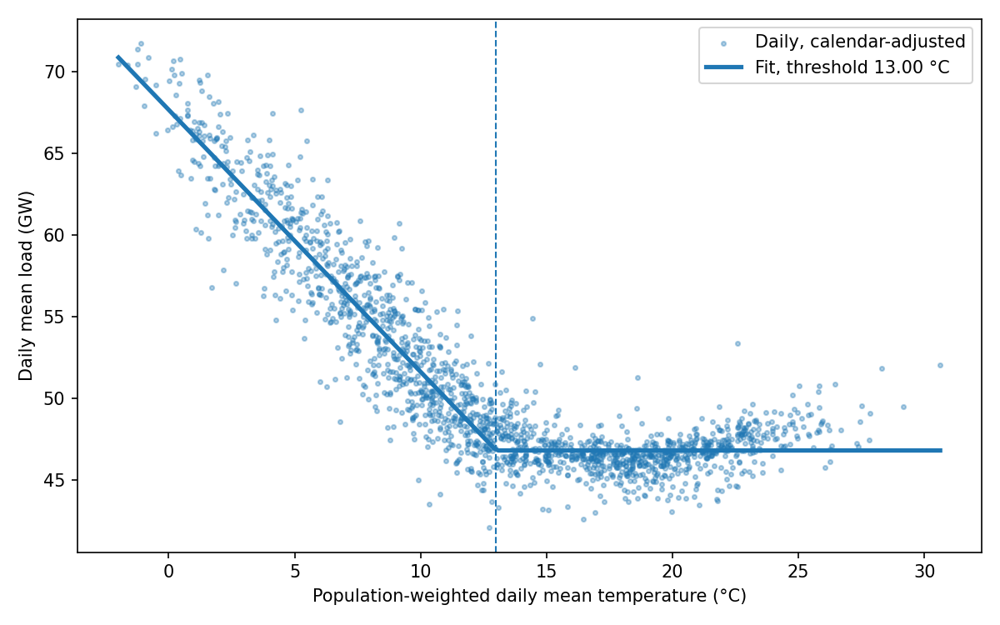
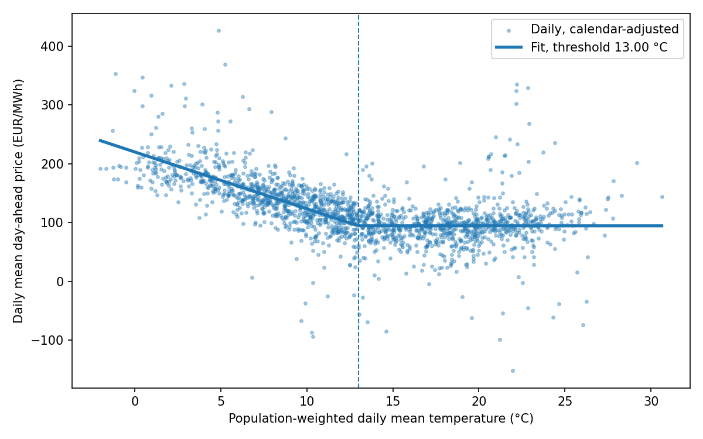
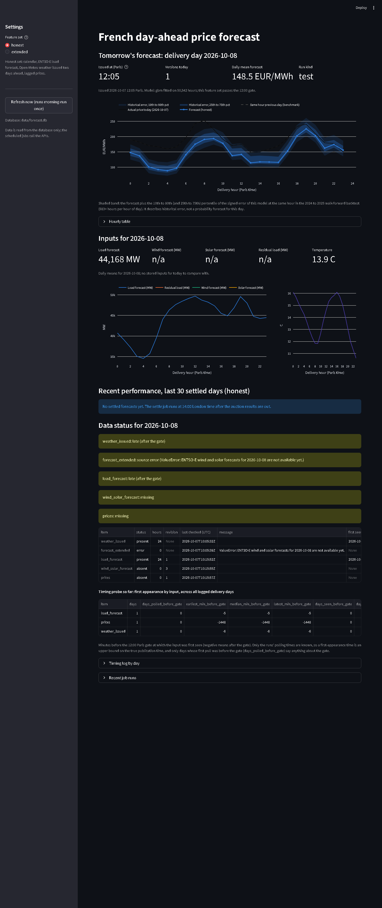

# thermo-fr

**Live dashboard:** https://YOUR-APP.streamlit.app (updated on weekday mornings and after each auction; see [docs/public_dashboard.md](docs/public_dashboard.md) for how it is produced)

How much does French electricity demand rise when it gets colder, and what does that do to the day-ahead price?

France heats a large share of its homes with electricity, so its demand is unusually sensitive to temperature. RTE usually puts the winter figure at roughly 2,400 MW for each degree colder. This project estimates that number from public data, along with the matching day-ahead price effect, and checks the model out of sample.

## What it does

1. Downloads hourly French actual load and day-ahead prices from one of several pluggable sources (see below), and hourly temperatures for eight French cities from the Open-Meteo archive.
2. Builds a population-weighted national temperature and averages everything into local calendar days.
3. Fits a piecewise-linear model. Above a threshold temperature, weather barely moves demand. Below it, each degree colder adds a fixed amount of load. The threshold is chosen by grid search.
4. Fits the same shape to the day-ahead price, using the load model's threshold.
5. Trains on all but the last 12 months and forecasts the last 12 months of load to check the model out of sample.
6. Writes a summary and two charts to `reports/`.

## Results

Run on 2021-01-01 to 2025-12-31 (1,826 days) with RTE load, ENTSO-E day-ahead prices and Open-Meteo temperatures. All numbers below are copied from `reports/summary.json` and `reports/yearly.csv` as produced by `thermo-fr fit`.

- Heating threshold: 13.00 °C
- Load: +1,605 MW per degree colder below the threshold (s.e. 22), R² 0.962
- Price: +9.67 EUR/MWh per degree colder (s.e. 0.45), R² 0.874; excluding 2022: +6.58 (s.e. 0.30)
- Out of sample, last 365 days trained to 2024-12-31: MAE 1,593 MW, MAPE 3.12%

Year by year, with the threshold held at 13.00 °C:

| Year | Load MW per °C (s.e.) | Price EUR/MWh per °C (s.e.) | Price R² | Mean price EUR/MWh | Price gradient, % of mean |
|---|---|---|---|---|---|
| 2021 | 1,649 (50) | 6.92 (0.74) | 0.863 | 109.2 | 6.33 |
| 2022 | 1,763 (50) | 22.40 (1.69) | 0.754 | 275.9 | 8.12 |
| 2023 | 1,694 (48) | 8.27 (0.53) | 0.714 | 96.9 | 8.54 |
| 2024 | 1,456 (53) | 4.62 (0.56) | 0.647 | 58.0 | 7.96 |
| 2025 | 1,469 (46) | 6.30 (0.50) | 0.722 | 61.1 | 10.31 |

Load sensitivity has fallen: the 2024 and 2025 estimates are about 14% below the 2021 to 2023 average, in line with the demand reductions that followed the 2022 energy crisis. The price effect in EUR/MWh moves with the price level, 22.4 in 2022 against 4.6 to 8.3 in the other years, but as a share of each year's mean price it stays within 6 to 10%. A cold day therefore raises the day-ahead price by a fairly constant fraction, whatever gas costs that year.





## Setup

```bash
python -m venv .venv
source .venv/bin/activate          # Windows: .venv\Scripts\activate
pip install -e ".[dev]"            # add ",forecast" inside the brackets for the price forecast (LightGBM, scikit-learn)
```

Open-Meteo, Energy-Charts and RTE need no key. Only the `entsoe` source does.

## Usage

```bash
thermo-fr demo                                      # offline, synthetic data with known answers
thermo-fr fetch --start 2021-01-01 --end 2026-01-01 # real data, saved to data/hourly.csv
thermo-fr fit                                       # results in reports/
pytest                                              # run the tests, all offline
```

`fetch` takes `--load-source` and `--price-source`, each one of `rte`, `energy-charts`, `entsoe` or `csv`. The defaults are `rte` for load and `energy-charts` for prices, which need no key:

```bash
thermo-fr fetch --start 2021-01-01 --end 2026-01-01 --load-source rte --price-source energy-charts
thermo-fr fetch --start 2021-01-01 --end 2026-01-01 --load-source csv --price-source csv --csv-dir data/csv
```

Next to `data/hourly.csv`, `fetch` writes `sources.json` (which source produced which series, with licence attribution and the dataset details) and `quality.json`. A short quality summary is printed: the share of missing hours per series, negative load, load outside 20,000 to 100,000 MW, and prices outside -500 to 4,000 EUR/MWh. Gaps are reported, never filled. `fit` copies the source information into `summary.json` and `summary.md`.

## Day-ahead price forecast

A second pipeline forecasts the hourly French day-ahead price for a delivery day using only information available when the auction closes, at 12:00 Paris time the day before. Method, timing findings and backtest results are in [docs/forecast.md](docs/forecast.md).

```bash
pip install -e ".[dev,forecast]"                  # adds LightGBM and scikit-learn
export ENTSOE_API_KEY="your-token"
thermo-fr forecast-fetch                           # inputs 2021-01-01 to the last complete month, into data/forecast/
thermo-fr forecast-backtest                        # walk-forward 2024 and 2025, report in reports/forecast/
thermo-fr forecast --date 2026-10-06               # one day's curve and chart, as of 12:00 the day before
thermo-fr timing-probe                             # log which ENTSO-E items already exist for tomorrow
```

Results are reported as forecast error (MAE and RMSE) against a naive baseline, the price of the same hour on the previous day. Limitations: the model is not benchmarked against traded market prices (EEX futures or OTC day-ahead quotes), so it makes no claim about beating the market, and the error band on the dashboards is the model's past error, not a probability forecast.

Inputs: ENTSO-E day-ahead prices, day-ahead total load forecast and day-ahead wind and solar forecasts (RESTful API, cached under `data/cache/entsoe/`), and Open-Meteo weather forecasts for the eight cities as they were issued two days ahead (previous-runs archive, cached under `data/cache/open-meteo/`). Two feature sets are evaluated: an honest one whose every input is published before the gate, and an extended one that adds the ENTSO-E wind and solar forecasts, which the platform allows until 18:00 on D-1. A test fails if any feature for delivery day D is timestamped after 12:00 Paris on D-1.

## Scheduled jobs and dashboard

Two jobs keep a local SQLite database (`data/forecast.db`) up to date, and a Streamlit dashboard reads it. The jobs are the only code that calls the APIs.

```bash
pip install -e ".[dev,forecast,dashboard]"       # adds streamlit and plotly
thermo-fr morning-run                             # tomorrow's inputs, timing log, both forecasts (new version each run)
thermo-fr settle                                  # actual prices, then every unscored forecast version is scored
thermo-fr dashboard                               # http://localhost:8501
```

`morning-run` fetches the ENTSO-E day-ahead load forecast, wind and solar forecasts and prices around the next delivery day, and the Open-Meteo weather forecasts issued two days ahead. For each input it records whether it is present for the delivery day, its hour count, revision number and a hash of its values, so the timing log (table `timing_log`) shows when each input first appeared relative to the 12:00 Paris gate and whether it changed between runs. It then stores the hourly inputs and a forecast for the honest feature set and, when the wind and solar forecasts exist, for the extended set. Every forecast is a new version stamped with its issue time; nothing is overwritten. A source that is down is logged in `data_status` and the run finishes as `partial` or `failed` instead of crashing. `settle` fetches the actual prices for today, tomorrow and every forecast day, stores them, and scores each version against them and against the same-hour-previous-day baseline. Both commands log to `logs/<command>_<date>.log`.

Windows Task Scheduler entries (the jobs run as the current user and read `ENTSOE_API_KEY` from the user environment, so set it with `setx ENTSOE_API_KEY ...` once):

```powershell
powershell -ExecutionPolicy Bypass -File scripts\schedule_tasks.ps1 -Install   # morning-run weekdays 07:00, 08:00, 09:00, 10:00, 10:45, 11:30; settle daily 14:00 (local time, London intended)
powershell -ExecutionPolicy Bypass -File scripts\schedule_tasks.ps1 -Show
powershell -ExecutionPolicy Bypass -File scripts\schedule_tasks.ps1 -Remove
```

Both tasks have "run task as soon as possible after a scheduled start is missed" and "wake the computer to run this task" turned on. Waking from sleep or hibernation also needs Windows to allow wake timers: Power Options, Sleep, Allow wake timers set to Enable for both plugged in and on battery (`powercfg /setacvalueindex SCHEME_CURRENT SUB_SLEEP RTCWAKE 1`, the same with `/setdcvalueindex`, then `powercfg /setactive SCHEME_CURRENT`). A machine that is shut down cannot be woken by a task.

The dashboard shows tomorrow's latest forecast with today's actual prices, the same-hour-previous-day benchmark and a shaded band built from the backtest's error distribution at each hour (historical error, not a probability forecast); tomorrow's forecast load, wind, solar, residual load and temperature with the change against today's inputs; the last 30 settled days against actual prices with rolling MAE and the share of days whose MAE was below the naive baseline's; the data status for tomorrow (arrival time of each input, anything missing or late) and the timing-probe summary across all logged days. A sidebar toggle switches between the honest and extended feature sets, with a note that the extended set may use information published after the gate until the timing log shows otherwise. Database reads are cached; the "Refresh now" button runs `morning-run` once.



## Public dashboard and automated updates

`streamlit_app.py` is a public version of the dashboard that reads only `published/` and runs on Streamlit Community Cloud. A GitHub Actions workflow keeps that folder current without any local machine: on weekday mornings it fetches the days around the next delivery day and publishes the forecast made with the stored model, every afternoon it fetches the auction results and scores the stored forecasts, and on the first weekday of each month it fetches the full history, refits the honest model and commits the model file with its metadata. The token lives in a repository secret and is never printed or committed. `published/` holds the last 90 days of forecasts (with issue times), actual prices, the benchmark, daily errors, tomorrow's latest forecast, the backtest error band and the model; no inputs history is kept in the repository.

```bash
thermo-fr publish                   # export the public dataset from the local database
thermo-fr import-published          # the reverse, used by the workflow to restore its state
thermo-fr refit-model               # fetch the full history and save published/model/honest.txt plus metadata
thermo-fr morning-run --model-file published/model/honest.txt --feature-sets honest   # predict with the stored model
streamlit run streamlit_app.py      # the public app, locally
```

Setup steps (secret, Streamlit deployment, live link) and the data-terms notes are in [docs/public_dashboard.md](docs/public_dashboard.md).

## Data sources

| Name | Series | Key | Where the data comes from |
|---|---|---|---|
| `rte` | load | none | RTE eCO2mix national consumption on ODRE, `eco2mix-national-cons-def` (definitive and consolidated) plus `eco2mix-national-tr` (real time) for the most recent weeks |
| `energy-charts` | load, prices | none | Energy-Charts API by Fraunhofer ISE: `/price?bzn=FR` and the `Load` series of `/public_power?country=fr` |
| `entsoe` | load, prices, day-ahead forecasts | `ENTSOE_API_KEY` | ENTSO-E Transparency Platform RESTful API, raw XML cached under `data/cache/entsoe/` |
| `csv` | load, prices | none | CSV files exported by hand from the ENTSO-E Transparency Platform website, placed in `--csv-dir` |

Raw responses from `rte` and `energy-charts` are cached under `data/cache/`, so a rerun downloads nothing. Delete that directory to refresh. Requests are spaced out to respect the published rate limits (about 2 per minute on the Energy-Charts price endpoint), and retried with exponential backoff on 429 and 503. If a service stays down, the fetch stops with a clear error instead of writing partial data.

### Attribution and licences

- Energy-Charts data is published by Fraunhofer ISE at https://energy-charts.info under the CC BY 4.0 licence. French day-ahead prices on Energy-Charts originate from Bundesnetzagentur | SMARD.de. Whenever this source is used the attribution is written into `sources.json`, `summary.json` and `summary.md`.
- RTE eCO2mix data is published on https://opendata.reseaux-energies.fr under the Licence Ouverte v2.0 (Etalab).
- Weather data by Open-Meteo.com, https://open-meteo.com, CC BY 4.0.
- ENTSO-E Transparency Platform data is subject to the platform's terms of use.

### ENTSO-E API key (only for the `entsoe` source)

1. Register for a free account at https://transparency.entsoe.eu.
2. Email transparency@entsoe.eu with the subject "Restful API access" and the email address of your account in the body.
3. Once access is granted, generate the token in your account settings, then:

```bash
export ENTSOE_API_KEY="your-token"   # Windows: set ENTSOE_API_KEY=your-token
```

### CSV exports from the ENTSO-E website (the `csv` source)

Export "Actual Total Load" and "Day-ahead Prices" for the France bidding zone as CSV and put the files in one directory. Files are recognised by their header, so names do not matter and one file per year is fine; empty files are skipped and timestamps repeated across files are dropped. The current export writes "MTU (UTC)" intervals such as "01/01/2025 00:00:00 - 01/01/2025 00:15:00", which are taken as UTC. Older exports with "MTU (CET/CEST)" or "Time (CET/CEST)" are parsed as Paris local time, and the repeated 02:00 hour on the autumn daylight-saving day is resolved by file order. Both 15-minute and hourly files work. When a Sequence column lists more than one auction, only the main day-ahead coupling result ("Without Sequence", else the lowest sequence number) is kept.

## Design choices

- **UTC everywhere, local time only for grouping into days.** The spring daylight-saving day has 23 hours and the autumn one has 25. Converting to Paris time only at the grouping step keeps both days intact, and the tests check this for every source.
- **Sub-hourly data is averaged to hourly.** The day-ahead market moved to 15-minute products in 2025, so prices and load are resampled to hourly means before anything else.
- **Fixed effects for each calendar month.** The slope is learned from day-to-day weather swings within a month, not from the gap between summer and winter. This stops changes in gas prices, demand trends or policy from leaking into the temperature estimate.
- **Population weighting.** Paris carries more weight than Strasbourg because that is where the heating load is. The weights are approximate metropolitan populations.
- **Weekday and public-holiday controls.** French holidays come from the `holidays` package.
- **Sources are interchangeable.** Every source implements the same two methods, `load(start, end)` and `day_ahead_prices(start, end)`, returning hourly tz-aware UTC series named `load_mw` and `price_eur_mwh`. A source that lacks a series says so instead of guessing.

## Limitations

- Standard errors are conditional on the chosen threshold, so they understate the true uncertainty a little.
- The model is daily. Hourly shape, especially the evening peak, would need a separate model.
- The price effect mixes the demand response with anything else that tends to happen on cold days (low wind, plant outages). Adding nuclear availability and renewable output would separate them.
- The out-of-sample check uses actual temperatures, so it measures the model, not the weather forecast.
- RTE's consolidated data omits the repeated hour on the autumn daylight-saving day, so that day has 24 of its 25 hours. It is kept, since the daily table only requires 22.

## Layout

```
src/thermo_fr/
  config.py              cities, weights, settings, plausibility ranges
  data/sources.py        the Source interface and get_source() factory
  data/http.py           rate-limited GET with retries, plus the raw-response cache
  data/weather.py        Open-Meteo temperatures and population weighting
  data/entsoe_rest.py    ENTSO-E RESTful API client: prices, load, day-ahead forecasts (needs a key)
  data/entsoe_client.py  the entsoe source built on it
  data/weather_forecast.py Open-Meteo forecasts as issued (previous runs) and the historical-forecast proxy
  forecast/timing.py     the 12:00 Paris gate, issue-time rules, look-ahead check
  forecast/inputs.py     one hourly table of every forecast input, plus the API-versus-CSV price comparison
  forecast/features.py   honest and extended feature sets in Paris delivery hours
  forecast/models.py     benchmarks, LightGBM, ridge
  forecast/backtest.py   monthly walk-forward, metrics by slice, worst days
  forecast/report.py     reports/forecast/ tables and charts
  forecast/day.py        one delivery day as of 12:00 the day before
  forecast/probe.py      timing probe for tomorrow's ENTSO-E items (superseded by morning-run)
  forecast/store.py      SQLite store: runs, data status, timing log, inputs, forecast versions, actuals, scores, error band
  forecast/jobs.py       morning-run and settle
  dashboard/data.py      read-only queries for the dashboard
  dashboard/app.py       the Streamlit app
scripts/schedule_tasks.ps1   install, show or remove the Task Scheduler entries
scripts/screenshot_dashboard.py  full-page screenshot of the running dashboard
forecast/publish.py      export and import of the public dataset under published/
forecast/refit.py        monthly refit: model file and metadata under published/model/
streamlit_app.py         public dashboard reading published/ only (Streamlit Community Cloud entry point)
.github/workflows/forecast.yml  scheduled morning-run and settle, committing published/
  data/energy_charts.py  Energy-Charts load and prices (no key)
  data/rte_eco2mix.py    RTE eCO2mix load from ODRE (no key)
  data/csv_source.py     ENTSO-E CSV exports made by hand
  data/quality.py        missing-hour and plausibility checks
  data/dataset.py        hourly to daily, DST-safe, calendar features
  model.py               threshold search and regression
  report.py              summary, charts, out-of-sample check
  synthetic.py           synthetic data with known answers
  cli.py                 command line
tests/                   DST handling, weighting, parameter recovery, every source offline
tests/fixtures/          small ENTSO-E style CSV samples covering both DST days
```

## Licence

The code is released under the MIT licence (see `LICENSE`). The data keep their own licences, listed under Attribution and licences above.
